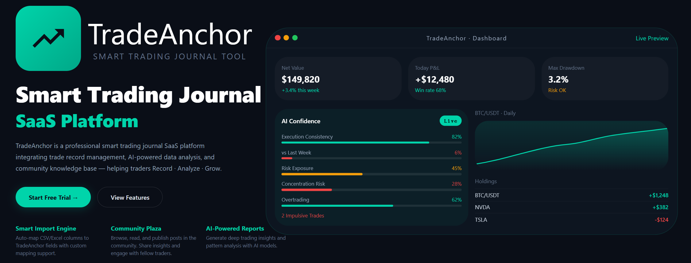
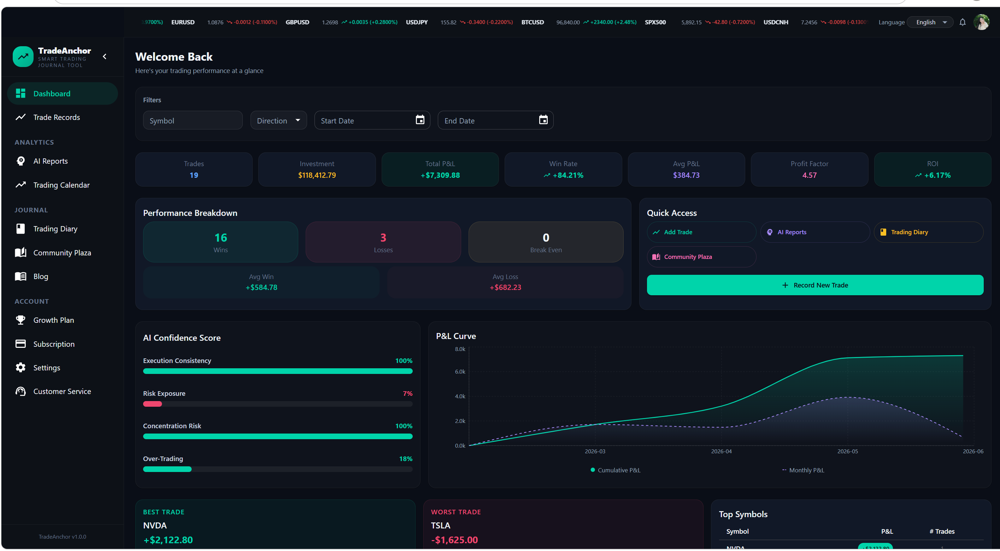
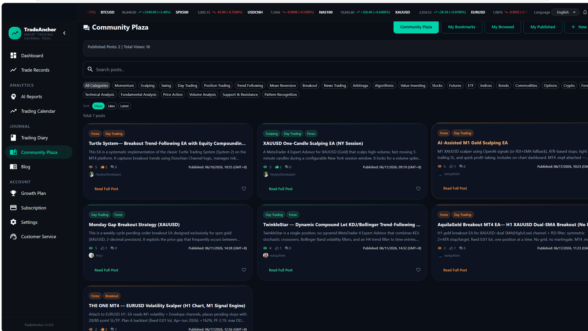
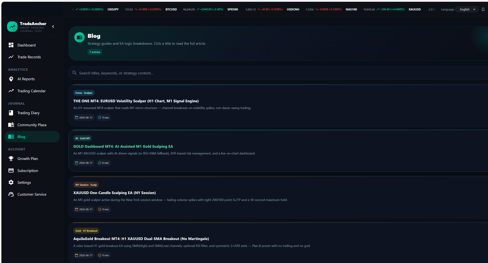
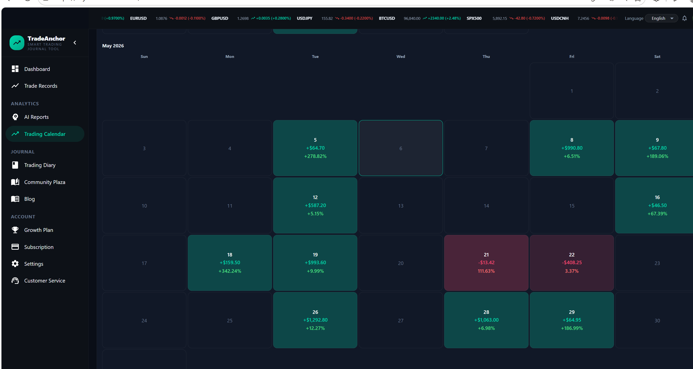
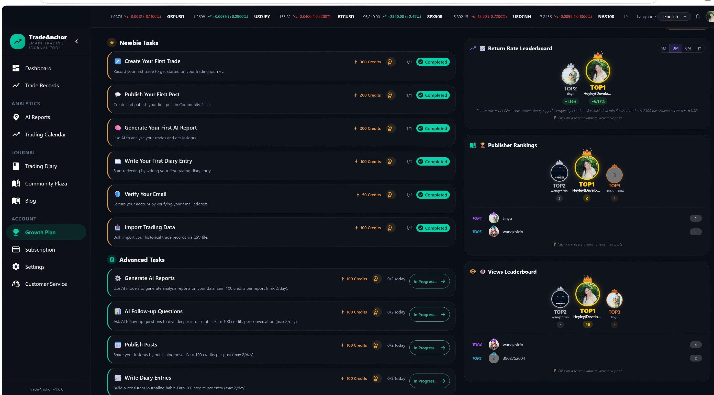

<div align="center">

# 🚀 TradeAnchor

**Smart Trading Journal SaaS Platform**

<p>
  <a href="https://github.com/heyleyhe2026-a11y/TradeAnchor/actions"></a>
  <a href="https://github.com/heyleyhe2026-a11y/TradeAnchor/blob/main/LICENSE"></a>
  
  
  
  
</p>



</div>

---

## 🌟 The Story

> Since May, I've been exploring **vibe coding** — doing everything solo: development, testing, deployment, launch, and iteration. In **15 working days**, I shipped a SaaS practice project: a community platform for overseas retail traders — basically a "leek" community for individual traders 😂
>
> Why did I want to build this? Because I'm a "big leek" myself 😄 I find the interfaces of established overseas trading communities not very appealing, while domestic EA communities charge money before you can download source code. On **TradeAnchor**, users just need to complete tasks to earn points and download source code — every single day.
>
> It's not perfect, but I've gone through the entire flow from idea to product launch. I haven't done any serious promotion yet — just put together a few SEO landing pages. Honestly, building a simple tool with basic features is even faster (a few hours to a couple of days). What's truly valuable now is the business model in your head.

## ✨ Features

### 📊 Smart Trading Dashboard
Comprehensive analytics including P&L curve, win rate, profit factor, AI confidence score, and trade performance breakdown.



### 🌐 Community Plaza
A bilingual community where traders share strategies, EA logic, and insights. Built-in translation system for community posts.



### 📚 Blog & Strategy Library
Curated strategy guides and EA logic breakdowns. Click any title to read the full article.



### 📅 Trading Calendar
Visualize daily trading performance with color-coded win/loss tiles.



### 🎯 Growth Plan & Credit System
Complete daily tasks to earn credits, unlock downloads, and climb the leaderboards.



### 🤖 AI-Powered Reports
Generate deep trading insights and pattern analysis with AI models (OpenAI / Anthropic).

### 🌍 Bilingual Interface
Smart language switching between English and Chinese (简体中文), with i18n-ready architecture.

## 🛠 Tech Stack

- **Frontend**: React 18, Vite, TypeScript, MUI, Redux Toolkit, React Router, Recharts
- **Backend**: NestJS / Express, TypeScript, Prisma ORM
- **Databases**: PostgreSQL, Redis, MongoDB
- **AI**: OpenAI, Anthropic
- **DevOps**: Docker, Docker Compose, GitHub Actions, Prometheus, Grafana
- **Deployment**: Kubernetes manifests + Nginx

## 🚀 Quick Start

### Prerequisites

- Node.js >= 20.0.0
- pnpm >= 8.0.0
- PostgreSQL, Redis, MongoDB (or use Docker Compose)

### Installation

```bash
# Install dependencies
pnpm install
```

### Environment Variables

Copy the example files and configure your secrets:

```bash
# Backend
cp packages/backend/.env.example packages/backend/.env

# Frontend
cp packages/frontend/.env.example packages/frontend/.env
```

> ⚠️ **Security Warning**: Never commit real `.env` files, API keys, passwords, or server IPs to Git. They are excluded via `.gitignore`.

### Development

```bash
# Run all packages in development mode
pnpm dev

# Run specific package
pnpm --filter @tradeanchor/backend dev
pnpm --filter @tradeanchor/frontend dev
```

### Database Setup

```bash
# Generate Prisma client
pnpm --filter @tradeanchor/backend db:generate

# Run migrations
pnpm --filter @tradeanchor/backend db:migrate

# (Optional) Seed mock data
pnpm --filter @tradeanchor/backend db:seed
```

### Build & Test

```bash
# Build all packages
pnpm build

# Run tests
pnpm test

# Lint and format
pnpm lint
pnpm format
```

## 🐳 Docker

```bash
# Start the full local stack
docker-compose up -d

# Production build
docker-compose -f docker-compose.prod.yml up -d
```

## 📁 Project Structure

```
tradeanchor/
├── packages/
│   ├── backend/          # NestJS API server
│   ├── frontend/         # React + Vite web application
│   ├── shared/           # Shared types and utilities
│   ├── marketing/        # Astro-based marketing site
│   └── prerender/        # SEO prerender service
├── docker-compose.yml    # Local development stack
├── docker-compose.prod.yml # Production stack
├── k8s/                  # Kubernetes manifests
├── monitoring/           # Prometheus & Grafana
├── docs/                 # Documentation & screenshots
└── README.md
```

## 🔐 Security Notes

- All real credentials, API keys, and server IPs are kept in `.env` files and excluded from version control.
- Deployment scripts containing real server details are excluded from version control.
- Before making the repository public, rotate any API keys that may have been exposed in local history.

## 📄 Documentation

- [docs/GITHUB_UPLOAD.md](docs/GITHUB_UPLOAD.md) — Safe upload to GitHub (secrets checklist)
- [AI_MODELS_GUIDE.md](AI_MODELS_GUIDE.md) — AI provider integration guide
- [CI_CD_MONITORING.md](CI_CD_MONITORING.md) — CI/CD and monitoring setup
- [DEPLOYMENT.md](DEPLOYMENT.md) — Full deployment guide
- [DEPLOY_INCREMENTAL.md](DEPLOY_INCREMENTAL.md) — Incremental deployment workflow

## 📝 License

MIT © [heyleyhe2026-a11y](https://github.com/heyleyhe2026-a11y)
